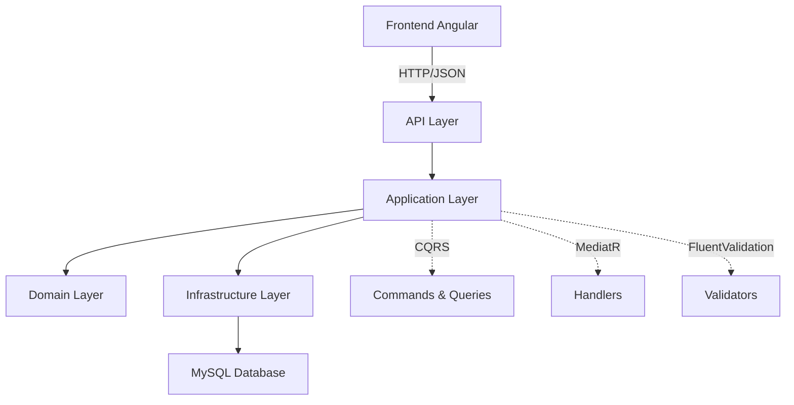

# Sistema de Cartão de Vacinação

> Sistema para gerenciamento de cartões de vacinação pessoais, desenvolvido com Angular 20 no frontend e .NET 8 no backend, utilizando arquitetura limpa e padrões modernos de desenvolvimento.

## 📋 Visão Geral

O sistema permite o gerenciamento completo de cartões de vacinação, incluindo cadastro de vacinas, pessoas e registro de vacinações aplicadas. Foi desenvolvido seguindo princípios de Clean Architecture, CQRS e Result Pattern para garantir alta qualidade, testabilidade e manutenibilidade do código.

### Funcionalidades Principais

- ✅ **Gestão de Vacinas**: Cadastro e consulta de vacinas com suas respectivas doses requeridas
- ✅ **Cadastro de Pessoas**: Registro completo com validação de CPF, email e dados pessoais
- ✅ **Registro de Vacinações**: Aplicação de doses com validação de sequência e integridade
- ✅ **Cartão Digital**: Visualização completa do histórico de vacinações por pessoa
- ✅ **Autenticação**: Sistema básico de login e controle de acesso
- ✅ **Auditoria**: Trilhas de criação e modificação de registros

---

## 🏗️ Arquitetura

O projeto segue os princípios da **Clean Architecture**, separando responsabilidades em camadas bem definidas:



### Padrões Implementados

#### **Clean Architecture**
- **Presentation**: Controllers e endpoints da API
- **Application**: Commands, Queries, Handlers e Validators
- **Domain**: Entidades, interfaces e regras de negócio
- **Infrastructure**: Implementações de repositórios, EF Core e acesso a dados

#### **CQRS (Command Query Responsibility Segregation)**
- **Commands**: Operações que modificam estado (Create, Update, Delete)
- **Queries**: Operações de consulta otimizadas para leitura
- Separação clara de responsabilidades entre escrita e leitura

#### **MediatR Pattern**
- Orquestração de requests através de handlers específicos
- Pipeline behaviors para validações e cross-cutting concerns
- Baixo acoplamento entre controllers e lógica de negócio

#### **Result Pattern**
- Retorno padronizado para operações (Success/Failure)
- Eliminação de exceptions para controle de fluxo
- Tratamento consistente de erros em todas as camadas

#### **Repository Pattern**
- Abstração do acesso a dados
- Facilita testes unitários com mocks
- Desacoplamento entre domínio e infraestrutura

---

## 🛠️ Stack Tecnológica

### Backend (.NET 8)
```
📦 Core Technologies
├─ ASP.NET Core Web API
├─ Entity Framework Core 8
├─ MySQL 
├─ MediatR
├─ FluentValidation
└─ Moq + xUnit (Testes)

📦 Architecture Patterns
├─ Clean Architecture
├─ CQRS
├─ Repository Pattern
├─ Result Pattern
└─ Domain-Driven Design
```

### Frontend (Angular 17+)
```
📦 Core Technologies
├─ Angular 17+ (Standalone Components)
├─ TypeScript
└─ RxJS

📦 Architecture Patterns
├─ Standalone Components
├─ Micro Components
└─ Component-based Architecture
```

### Database
```
📦 MySQL 8+
├─ Code-First Migrations
├─ Referential Integrity
├─ Audit Trail Support
└─ Optimized Queries
```

---

## 🧪 Testes Automatizados

O projeto implementa uma estratégia abrangente de testes unitários:

### Cobertura de Testes
- **Handlers**: Todos os Command e Query handlers
- **Validators**: FluentValidation validators
- **Domain Services**: Regras de negócio críticas
- **Repository Pattern**: Mocks para isolamento de testes

### Exemplo de Teste
```csharp
[Fact]
public async Task Handle_ShouldReturnFailure_WhenPersonNotFound()
{
    // Arrange
    var command = new CreateVaccinationCommand(Guid.NewGuid(), Guid.NewGuid(), 1, DateTime.UtcNow);
    _personRepositoryMock
        .Setup(r => r.GetByIdAsync(command.PersonId))
        .ReturnsAsync((Person?)null);

    // Act
    var result = await _handler.Handle(command, CancellationToken.None);

    // Assert
    Assert.True(result.IsFailure);
    Assert.Equal(PersonErrors.NotFound, result.Error);
}
```

---

## 📊 Modelo de Dados

### Entidades Principais

#### **Vaccine**
```csharp
    public class Vaccine : EntityBase
    {
        /// <summary>
        /// The name of the vaccine.
        /// </summary>
        public string Name { private set; get; }

        /// <summary>
        /// The collection of vaccination records that reference this vaccine.
        /// </summary>
        public List<Vaccination> VaccineRecords { private set; get; } = [];

        /// <summary>
        /// The total number of doses required to complete this vaccine's treatment schedule.
        /// </summary>
        public int RequiredDoses { private set; get; }
    }
```

#### **Person**
```csharp
    public class Person : EntityBase
    {
        /// <summary>
        /// The full name of the person.
        /// </summary>
        public string Name { get; private set; }

        /// <summary>
        /// The CPF (Cadastro de Pessoas Físicas) identifier of the person.
        /// </summary>
        public string CPF { get; private set; }

        /// <summary>
        /// The email address of the person.
        /// </summary>
        public string Email { get; private set; }

        /// <summary>
        /// The phone number of the person.
        /// </summary>
        public string PhoneNumber { get; private set; }

        /// <summary>
        /// The gender of the person.
        /// </summary>
        public string Gender { get; private set; }

        /// <summary>
        /// The age of the person.
        /// </summary>
        public int Age { get; private set; }

        /// <summary>
        /// The list of vaccinations associated with the person.
        /// </summary>
        public List<Vaccination> Vaccinations { get; private set; } = [];
    }
```

#### **Vaccination**
```csharp
   /// <summary>
   /// Represents a vaccination record associated with a specific person and vaccine.
   /// </summary>
    public class Vaccination : EntityBase
    {
        /// <summary>
        /// he date when the vaccine was applied.
        /// </summary>
        public DateTime ApplicationDate { get; private set; }

        /// <summary>
        /// The unique identifier of the vaccine administered.
        /// </summary>
        public Guid VaccineId { get; private set; }

        /// <summary>
        /// The vaccine entity associated with this vaccination record.
        /// </summary>
        public Vaccine Vaccine { get; private set; }

        /// <summary>
        /// The unique identifier of the person who received the vaccination.
        /// </summary>
        public Guid PersonId { get; private set; }

        /// <summary>
        /// The person entity associated with this vaccination record.
        /// </summary>
        public Person Person { get; private set; }

        /// <summary>
        /// The dose number of the vaccine (e.g., 1 for first dose, 2 for second dose).
        /// </summary>
        public int DoseNumber { get; private set; }
    }
```

---

## 🎨 Frontend - Angular Standalone Components

### Arquitetura de Componentes

O frontend utiliza **Angular Standalone Components**, proporcionando:

- **Modularidade**: Componentes independentes sem necessidade de NgModules
- **Tree-shaking**: Melhor otimização de bundle
- **Simplicidade**: Menos boilerplate e configuração
- **Reutilização**: Componentes totalmente auto-contidos

### Estrutura de Componentes
```
src/app/
├─ shared/
│  ├─ components/          # Micro componentes reutilizáveis
│  │  ├─ button/
│  │  ├─ input/
│  │  ├─ modal/
│  │  └─ table/
│  └─ services/           # Serviços compartilhados
├─ features/
│  ├─ vaccines/
│  │  ├─ components/
│  │  └─ services/
│  ├─ persons/
│  │  ├─ components/
│  │  └─ services/
│  └─ vaccinations/
│     ├─ components/
│     └─ services/
└─ pages/                 # Páginas principais
   ├─ dashboard/
   ├─ vaccination-card/
   └─ login/
```

### Exemplo de Standalone Component
```typescript
@Component({
  selector: 'app-vaccination-form',
  standalone: true,
  imports: [CommonModule, ReactiveFormsModule],
  template: `
    <form [formGroup]="form" (ngSubmit)="onSubmit()">
      <!-- form content -->
    </form>
  `
})
export class VaccinationFormComponent {
  // component logic
}
```

---

## 🚀 Estrutura do Projeto

```
/
├─ backend/
│  ├─ src/
│  │  ├─ VaccinationCard.Api/           # Controllers, DI, Middlewares
│  │  ├─ VaccinationCard.Application/   # CQRS, DTOs, Validators
│  │  ├─ VaccinationCard.Domain/        # Entidades, Interfaces, Rules
│  │  └─ VaccinationCard.Infrastructure/ # EF Core, Repositories
│  └─ tests/
│     └─ VaccinationCard.Tests.Unit/    # Testes unitários
└─ frontend/
   ├─ src/
   ├─ app/                 
   ├─ shared/                     # Componentes compartilhados
   └─  features/                   # Features do sistema
```

---

## 🔧 Pipeline de Validação

### FluentValidation + MediatR Pipeline

```csharp
    internal class CreatePersonCommandValidator : AbstractValidator<CreatePersonCommand>
    {
        public CreatePersonCommandValidator()
        {
            RuleFor(x => x.Name)
                .MaximumLength(80).WithMessage(PersonErrors.NameIsToLong)
                .NotEmpty().WithMessage(PersonErrors.NameIsObligatory)
                .MinimumLength(3).WithMessage(PersonErrors.NameInvalidMinimumLength);

            RuleFor(x => x.Email)
                .NotEmpty().WithMessage(PersonErrors.EmailIsRequired)
                .EmailAddress().WithMessage(PersonErrors.EmailIsInvalid);

            RuleFor(x => x.Age)
                .GreaterThanOrEqualTo(0)
                .WithMessage(PersonErrors.InvalidAge);

            RuleFor(x => x.CPF)
                .NotEmpty()
                .WithMessage(PersonErrors.CPFIsObligatory)
                .Length(11)
                .WithMessage(PersonErrors.InvalidCPFLength);
        }
    }
```

### Result Pattern Implementation
```csharp
public class Result
{
    protected Result(bool isSuccess, Error error, HttpStatusCode statusCode)
    {
        IsSuccess = isSuccess;
        Error = error;
        StatusCode = statusCode;
    }

    public bool IsSuccess { get; }

    public bool IsFailure => !IsSuccess;

    public Error Error { get; }

    public HttpStatusCode StatusCode { get; }

    public static Result Success(HttpStatusCode statusCode = HttpStatusCode.OK) => new(true, Error.None, statusCode);

    public static Result Failure(Error error, HttpStatusCode statusCode = HttpStatusCode.BadRequest) => new(false, error, statusCode);
}

public class Result<T> : Result
{
    private Result(T value, HttpStatusCode statusCode) : base(true, Error.None, statusCode)
    {
        Value = value;
    }

    private Result(Error error, HttpStatusCode status) : base(false, error, status)
    {
        Value = default;
    }

    public T? Value { get; }

    public static Result<T> Success(T value, HttpStatusCode statusCode = HttpStatusCode.OK) => new(value, statusCode);

    public static new Result<T> Failure(Error error, HttpStatusCode status = HttpStatusCode.BadRequest) =>new(error, status);
}


```

---

## 📈 Roadmap

### ✅ Implementado
- [x] Clean Architecture com CQRS
- [x] Result Pattern
- [x] Testes unitários automatizados
- [x] Angular Standalone Components
- [x] Sistema básico de autenticação
- [x] Auditoria de registros

### 🎯 Próximos Passos
- [ ] Testes de integração completos
- [ ] Docker Compose para ambiente completo
- [ ] CI/CD Pipeline

---

## 🏃‍♂️ Como Executar

### Backend
```bash
cd backend/src/VaccinationCard.Api
dotnet restore
dotnet ef database update
dotnet run
```

### Frontend
```bash
cd frontend
npm install
ng serve
```

### Testes
```bash
# Backend
dotnet test

# Frontend
ng test
```

---

### Padrão de Commits
Utilizamos [Conventional Commits](https://www.conventionalcommits.org/):
- `feat:` - Nova funcionalidade
- `fix:` - Correção de bug
- `docs:` - Documentação
- `test:` - Testes
- `refactor:` - Refatoração
- `chore:` - Manutenção

---
